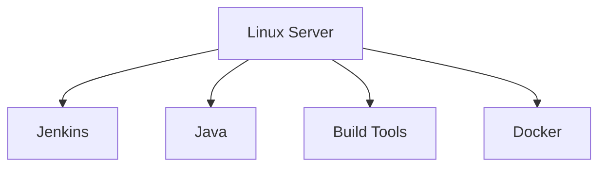
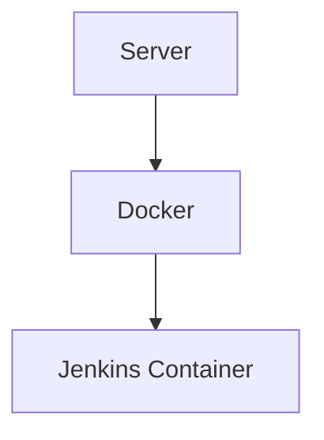
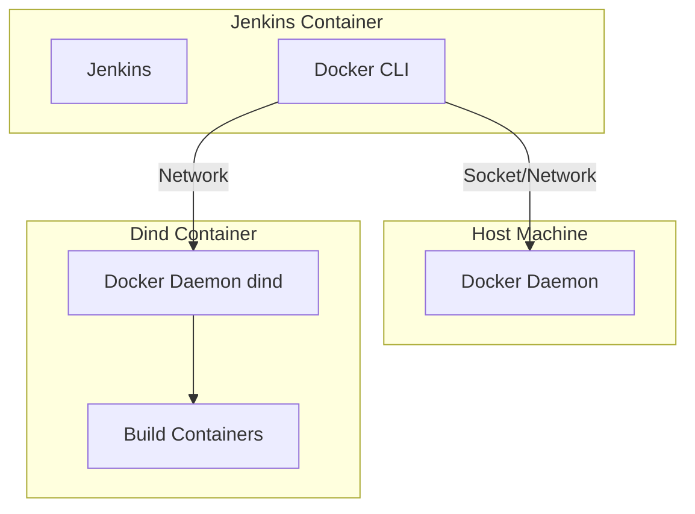
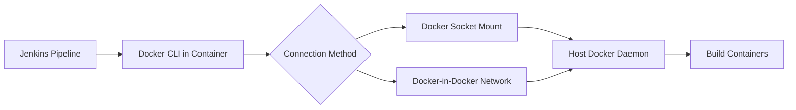
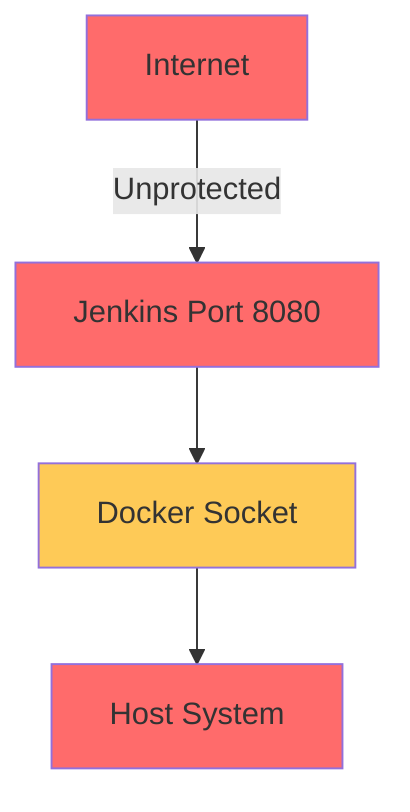
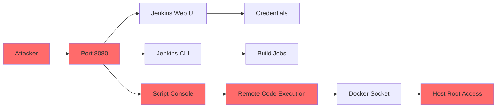
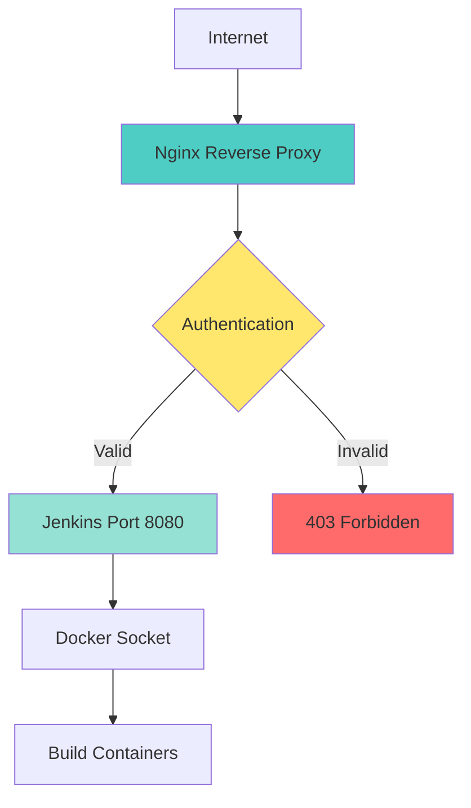

# JenkinsDock

Practical guide to running Jenkins with Docker, covering Docker-in-Docker builds and secure deployments behind an Nginx reverse proxy in a self-hosted environment.

---

## Table of Contents

1. [Jenkins Host vs Container](#jenkins-host-vs-container)
2. [Docker-in-Docker](#docker-in-docker-dind)
3. [Custom Jenkins Image](#jenkins-image-with-docker-cli)
4. [Security Risks](#security-risks-exposing-jenkins-on-port-8080)
5. [Reverse Proxy Pattern](#reverse-proxy-pattern)

---

## Overview

JenkinsDock is a reference project and guide for running Jenkins in containerized environments. The repository explains common deployment patterns, security pitfalls, and provides a ready-to-use Jenkins image that includes the Docker CLI.

This project focuses on:

* Understanding the difference between **Jenkins on host** vs **Jenkins in containers**
* Running **Docker builds from Jenkins using Docker-in-Docker (dind)**
* Providing a **Jenkins image bundled with docker-ce-cli**
* Highlighting **security risks when exposing Jenkins directly on port 8080**
* Demonstrating **why Jenkins should be placed behind a reverse proxy**

---

## Jenkins Host vs Container

Jenkins can run directly on a server (host installation) or inside a container.

### Host Installation



| Advantages | Disadvantages |
|------------|---------------|
| Simple to install | Dependency conflicts |
| Easy to access system resources | Harder to migrate |
| Direct hardware access | Less reproducible environments |
| No container overhead | Manual backup/restore |

### Containerized Jenkins



| Advantages | Disadvantages |
|------------|---------------|
| Reproducible environment | Requires Docker knowledge |
| Easier upgrades | Docker socket security considerations |
| Better isolation | Some build tools must run via containers |
| Simple backup (volume-based) | Network configuration complexity |

---

## Docker-in-Docker (dind)

To build Docker images from Jenkins pipelines, Jenkins must communicate with a Docker daemon.

### Architecture Overview



### Connection Methods

| Method | Description | Security |
|--------|-------------|----------|
| **Mount Docker Socket** | `-v /var/run/docker.sock:/var/run/docker.sock` | ⚠️ Low - Jenkins has full host Docker access |
| **Docker-in-Docker (dind)** | Separate Docker daemon in isolated container | ⚠️ Medium - Better isolation |
| **Docker Out-of-Docker** | Jenkins container connects to host daemon | ⚠️ Similar to socket mount |

Jenkins acts as the **client**, while the Docker daemon performs the actual builds.

---

## Jenkins Image with Docker CLI

### Why Docker CLI is Needed

When using Jenkins to build and deploy containerized applications, your Jenkinsfile typically needs to run Docker commands:

```groovy
pipeline {
    agent any
    stages {
        stage('Build Docker Image') {
            steps {
                sh 'docker build -t myapp:latest .'  // Requires docker CLI
                sh 'docker push myapp:latest'         // Requires docker CLI
            }
        }
    }
}
```

**The Problem:** The official `jenkins/jenkins:lts` image does **not** include the Docker CLI (`docker` command) by default. Running the above pipeline will fail with:

```
+ docker build -t myapp:latest .
script.sh: line 1: docker: command not found
```

### Solution: Custom Jenkins Image with docker-ce-cli

This repository provides a minimal extension of the official Jenkins image with **docker-ce-cli pre-installed**:

```dockerfile
FROM jenkins/jenkins:lts

USER root

RUN apt-get update \
 && apt-get install -y docker-ce-cli \
 && rm -rf /var/lib/apt/lists/*

USER jenkins
```

### What This Gives You

| Component | Purpose |
|-----------|---------|
| **docker** | Build, push, run containers |
| **docker-compose** | Multi-container orchestration (optional) |
| **docker context** | Manage multiple Docker daemons |

### How It Works



### Usage

After building this image, Jenkins pipelines can execute Docker commands:

```bash
# Build the custom Jenkins image
docker build -t jenkins-docker:latest .

# Run with Docker socket mounted
docker run -d -p 8080:8080 \
  -v jenkins-data:/var/jenkins_home \
  -v /var/run/docker.sock:/var/run/docker.sock \
  --name jenkins \
  jenkins-docker:latest
```

Now your Jenkinsfile can use:
```groovy
sh 'docker build -t myapp:${BUILD_NUMBER} .'
sh 'docker push myapp:${BUILD_NUMBER}'
sh 'docker run --rm myapp:${BUILD_NUMBER} npm test'
```

Example Dockerfile:

```dockerfile
FROM jenkins/jenkins:lts

USER root

RUN apt-get update \
 && apt-get install -y docker-ce-cli \
 && rm -rf /var/lib/apt/lists/*

USER jenkins
```

This allows Jenkins pipelines to run commands such as:

```
docker build
docker push
```

---

## Security Risks: Exposing Jenkins on Port 8080

### The Problem

A common mistake in self-hosted setups is exposing Jenkins directly to the internet without proper protection:



### Key Security Risks

| Risk | Impact | Description |
|------|--------|-------------|
| **Docker Socket Access** | 🔴 Critical | Jenkins with Docker socket access can spawn privileged containers, effectively giving root access to the host |
| **Container Escape** | 🔴 Critical | Vulnerabilities in Jenkins or plugins can allow attackers to escape the container and access the host system |
| **Unauthenticated Access** | 🔴 Critical | Default Jenkins setup may allow unauthenticated script console access, enabling remote code execution |
| **Network Exposure** | 🟡 High | Direct exposure on port 8080 without HTTPS means credentials and build logs are transmitted in plain text |
| **Plugin Vulnerabilities** | 🟡 High | Outdated or vulnerable plugins can provide attack vectors for exploitation |

### Attack Surface



### Mitigation Strategies

1. **Never expose port 8080 directly** - Always use a reverse proxy
2. **Enable HTTPS** - Use SSL/TLS certificates for encrypted communication
3. **Implement authentication** - Require login for all Jenkins access
4. **Restrict script console** - Disable or heavily restrict the Groovy script console
5. **Regular updates** - Keep Jenkins and all plugins up to date
6. **Network isolation** - Use firewall rules to limit access to trusted IPs
7. **Minimal permissions** - Run Jenkins with least-privilege Docker socket access

---

## Reverse Proxy Pattern

### Why Use a Reverse Proxy?

Placing Jenkins behind a reverse proxy (Nginx, Apache, Traefik) provides:

| Benefit | Description |
|---------|-------------|
| **HTTPS Termination** | Handle SSL/TLS at the proxy level, encrypting all traffic |
| **Authentication Layer** | Add additional authentication (Basic Auth, OAuth) before Jenkins |
| **Rate Limiting** | Protect against brute force and DDoS attacks |
| **Access Control** | Restrict access by IP address, geographic location, or other criteria |
| **Logging & Monitoring** | Centralized access logs and request tracking |
| **Load Balancing** | Distribute traffic across multiple Jenkins instances |

### Architecture



### Nginx Configuration Example

```nginx
server {
    listen 80;
    server_name jenkins.yourdomain.com;
    
    # Redirect HTTP to HTTPS
    return 301 https://$server_name$request_uri;
}

server {
    listen 443 ssl http2;
    server_name jenkins.yourdomain.com;

    # SSL Configuration
    ssl_certificate /etc/ssl/certs/jenkins.crt;
    ssl_certificate_key /etc/ssl/private/jenkins.key;
    ssl_protocols TLSv1.2 TLSv1.3;
    ssl_ciphers HIGH:!aNULL:!MD5;
    ssl_prefer_server_ciphers on;

    # Security Headers
    add_header X-Frame-Options "SAMEORIGIN" always;
    add_header X-Content-Type-Options "nosniff" always;
    add_header X-XSS-Protection "1; mode=block" always;
    add_header Strict-Transport-Security "max-age=31536000; includeSubDomains" always;

    # Jenkins Proxy
    location / {
        proxy_pass http://jenkins:8080;
        proxy_set_header Host $host;
        proxy_set_header X-Real-IP $remote_addr;
        proxy_set_header X-Forwarded-For $proxy_add_x_forwarded_for;
        proxy_set_header X-Forwarded-Proto $scheme;
        proxy_set_header X-Forwarded-Host $host;
        proxy_set_header X-Forwarded-Port $server_port;
        
        # WebSocket support (for Jenkins CLI)
        proxy_http_version 1.1;
        proxy_set_header Upgrade $http_upgrade;
        proxy_set_header Connection "upgrade";
        
        # Timeout settings
        proxy_connect_timeout 600s;
        proxy_send_timeout 600s;
        proxy_read_timeout 600s;
    }

    # Optional: IP Whitelist
    # allow 192.168.1.0/24;
    # allow 10.0.0.0/8;
    # deny all;
}
```

### Docker Compose Example

```yaml
version: '3.8'

services:
  nginx:
    image: nginx:alpine
    container_name: jenkins-nginx
    ports:
      - "80:80"
      - "443:443"
    volumes:
      - ./nginx/nginx.conf:/etc/nginx/nginx.conf:ro
      - ./nginx/ssl:/etc/ssl/certs:ro
    depends_on:
      - jenkins
    networks:
      - jenkins-network
    restart: unless-stopped

  jenkins:
    image: jenkins-docker:latest
    container_name: jenkins
    expose:
      - "8080"
      - "50000"
    volumes:
      - jenkins-data:/var/jenkins_home
      - /var/run/docker.sock:/var/run/docker.sock
    networks:
      - jenkins-network
    environment:
      - JAVA_OPTS=-Djenkins.install.runSetupWizard=false
    restart: unless-stopped

volumes:
  jenkins-data:

networks:
  jenkins-network:
    driver: bridge
```

### Best Practices

1. **Use Let's Encrypt** for free, auto-renewing SSL certificates
2. **Enable HSTS** to force HTTPS connections
3. **Configure rate limiting** to prevent brute force attacks
4. **Set up monitoring** for access logs and error rates
5. **Use internal networks** to isolate Jenkins from direct internet access
6. **Regular security audits** of Nginx configuration and Jenkins setup

---

## Goals of This Repository

| Goal | Description |
|------|-------------|
| **Practical Reference** | Provide hands-on guidance for Jenkins + Docker integration |
| **Security Awareness** | Document real-world security pitfalls and attack vectors |
| **Safe Patterns** | Demonstrate production-ready deployment architectures |
| **Reusable Templates** | Share Dockerfile, Nginx config, and Docker Compose examples |
| **Decision Framework** | Help teams choose between host vs container, dind vs socket mount |

---

## Quick Reference

### Dockerfile Template

```dockerfile
FROM jenkins/jenkins:lts

USER root

RUN apt-get update \
 && apt-get install -y docker-ce-cli \
 && rm -rf /var/lib/apt/lists/*

USER jenkins
```

### Essential Commands

```bash
# Build Jenkins image with Docker CLI
docker build -t jenkins-docker:latest .

# Run Jenkins (development - not production ready)
docker run -d -p 8080:8080 -v jenkins-data:/var/jenkins_home \
  -v /var/run/docker.sock:/var/run/docker.sock \
  --name jenkins jenkins-docker:latest

# Run with Docker Compose (recommended)
docker-compose up -d
```

### Security Checklist

- [ ] Jenkins behind Nginx reverse proxy
- [ ] HTTPS with valid SSL certificate
- [ ] Authentication enabled
- [ ] Script console disabled or restricted
- [ ] Docker socket access minimized
- [ ] Network isolation configured
- [ ] Regular updates scheduled
- [ ] Access logs monitored

---