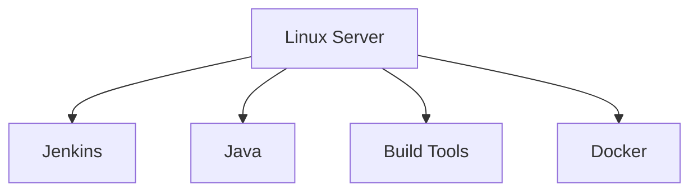
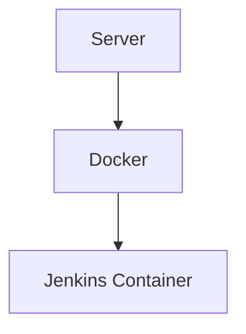
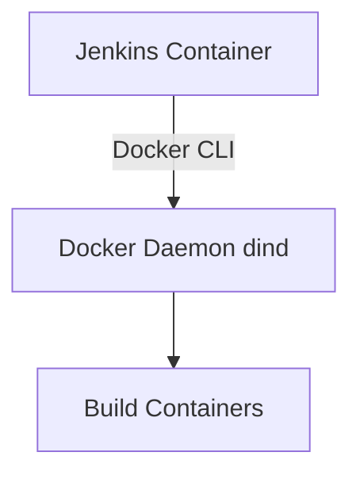
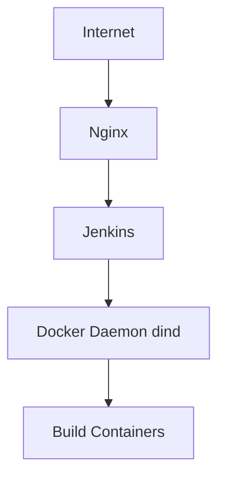

# JenkinsDock

Practical guide to running Jenkins with Docker, covering Docker-in-Docker builds and secure deployments behind an Nginx reverse proxy in a self-hosted environment.

---

## Overview

JenkinsDock is a reference project and guide for running Jenkins in containerized environments. The repository explains common deployment patterns, security pitfalls, and provides a ready-to-use Jenkins image that includes the Docker CLI.

This project focuses on:

* Understanding the difference between **Jenkins on host** vs **Jenkins in containers**
* Running **Docker builds from Jenkins using Docker-in-Docker (dind)**
* Providing a **Jenkins image bundled with docker-ce-cli**
* Highlighting **security risks when exposing Jenkins directly on port 8080**
* Demonstrating **why Jenkins should be placed behind a reverse proxy**

---

## Jenkins Host vs Container

Jenkins can run directly on a server (host installation) or inside a container.

### Host Installation



Pros:

* Simple to install
* Easy to access system resources

Cons:

* Dependency conflicts
* Harder to migrate
* Less reproducible environments

### Containerized Jenkins



Pros:

* Reproducible environment
* Easier upgrades
* Better isolation

Cons:

* Requires Docker knowledge
* Some build tools must run via containers

---

## Docker-in-Docker (dind)

To build Docker images from Jenkins pipelines, Jenkins must communicate with a Docker daemon.

Typical architecture:



Jenkins acts as the **client**, while the Docker daemon performs the actual builds.

---

## Jenkins Image with Docker CLI

The official Jenkins image does not include Docker CLI by default.

This repository provides a minimal extension of the official image with **docker-ce-cli installed**.

Example Dockerfile:

```dockerfile
FROM jenkins/jenkins:lts

USER root

RUN apt-get update \
 && apt-get install -y docker-ce-cli \
 && rm -rf /var/lib/apt/lists/*

USER jenkins
```

This allows Jenkins pipelines to run commands such as:

```
docker build
docker push
```

---

## Security Risk: Exposing Jenkins on Port 8080

A common mistake in self-hosted setups is exposing Jenkins directly to the internet:



---

## Goals of This Repository

- Provide a practical Jenkins + Docker reference
- Document real-world security pitfalls
- Demonstrate safe deployment patterns
- Share reusable infrastructure templates