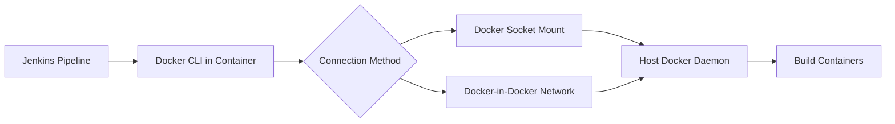

# Custom Jenkins Image with Docker CLI

## Why Docker CLI is Needed

When using Jenkins to build and deploy containerized applications, your Jenkinsfile typically needs to run Docker commands:

```groovy
pipeline {
    agent any
    stages {
        stage('Build Docker Image') {
            steps {
                sh 'docker build -t myapp:latest .'  // Requires docker CLI
                sh 'docker push myapp:latest'         // Requires docker CLI
            }
        }
    }
}
```

**The Problem:** The official `jenkins/jenkins:lts` image does **not** include the Docker CLI (`docker` command) by default. Running the above pipeline will fail with:

```
+ docker build -t myapp:latest .
script.sh: line 1: docker: command not found
```

## Solution: Custom Jenkins Image with docker-ce-cli

This repository provides a minimal extension of the official Jenkins image with **docker-ce-cli pre-installed**:

```dockerfile
FROM jenkins/jenkins:lts

USER root

RUN apt-get update \
 && apt-get install -y docker-ce-cli \
 && rm -rf /var/lib/apt/lists/*

USER jenkins
```

## What This Gives You

| Component | Purpose |
|-----------|---------|
| **docker** | Build, push, run containers |
| **docker-compose** | Multi-container orchestration (optional) |
| **docker context** | Manage multiple Docker daemons |

## How It Works



## Building the Image

```bash
# Build the custom Jenkins image
docker build -t jenkins-docker:latest .
```

## Usage

### Development Setup

```bash
# Run with Docker socket mounted
docker run -d -p 8080:8080 \
  -v jenkins-data:/var/jenkins_home \
  -v /var/run/docker.sock:/var/run/docker.sock \
  --name jenkins \
  jenkins-docker:latest
```

### Production Setup with Docker Compose

```yaml
version: '3.8'

services:
  jenkins:
    image: jenkins-docker:latest
    container_name: jenkins
    expose:
      - "8080"
      - "50000"
    volumes:
      - jenkins-data:/var/jenkins_home
      - /var/run/docker.sock:/var/run/docker.sock
    networks:
      - jenkins-network
    environment:
      - JAVA_OPTS=-Djenkins.install.runSetupWizard=false
    restart: unless-stopped

  nginx:
    image: nginx:alpine
    container_name: jenkins-nginx
    ports:
      - "80:80"
      - "443:443"
    volumes:
      - ./nginx/nginx.conf:/etc/nginx/nginx.conf:ro
      - ./nginx/ssl:/etc/ssl/certs:ro
    depends_on:
      - jenkins
    networks:
      - jenkins-network
    restart: unless-stopped

volumes:
  jenkins-data:

networks:
  jenkins-network:
    driver: bridge
```

## Pipeline Examples

### Basic Docker Build

```groovy
pipeline {
    agent any
    stages {
        stage('Build') {
            steps {
                sh 'docker build -t myapp:${BUILD_NUMBER} .'
            }
        }
        stage('Push') {
            steps {
                sh 'docker push myapp:${BUILD_NUMBER}'
            }
        }
        stage('Test') {
            steps {
                sh 'docker run --rm myapp:${BUILD_NUMBER} npm test'
            }
        }
    }
}
```

### Multi-stage Build

```groovy
pipeline {
    agent any
    stages {
        stage('Build Image') {
            steps {
                sh '''
                    docker build -t myapp:${BUILD_NUMBER} .
                    docker tag myapp:${BUILD_NUMBER} myapp:latest
                '''
            }
        }
        stage('Deploy') {
            steps {
                sh '''
                    docker stop myapp || true
                    docker rm myapp || true
                    docker run -d --name myapp -p 3000:3000 myapp:latest
                '''
            }
        }
    }
}
```

## Troubleshooting

### Permission Denied

If you get permission errors when accessing Docker socket:

```bash
# Add jenkins user to docker group (not recommended for production)
docker exec jenkins usermod -aG docker jenkins
```

Better solution: Use a Docker socket proxy with limited permissions.

### Docker Command Not Found

Verify the image was built correctly:

```bash
docker run --rm jenkins-docker:latest docker --version
```

## Next Steps

- [Security Risks](security-risks.md) - Understand security implications
- [Reverse Proxy](reverse-proxy.md) - Production deployment with Nginx
