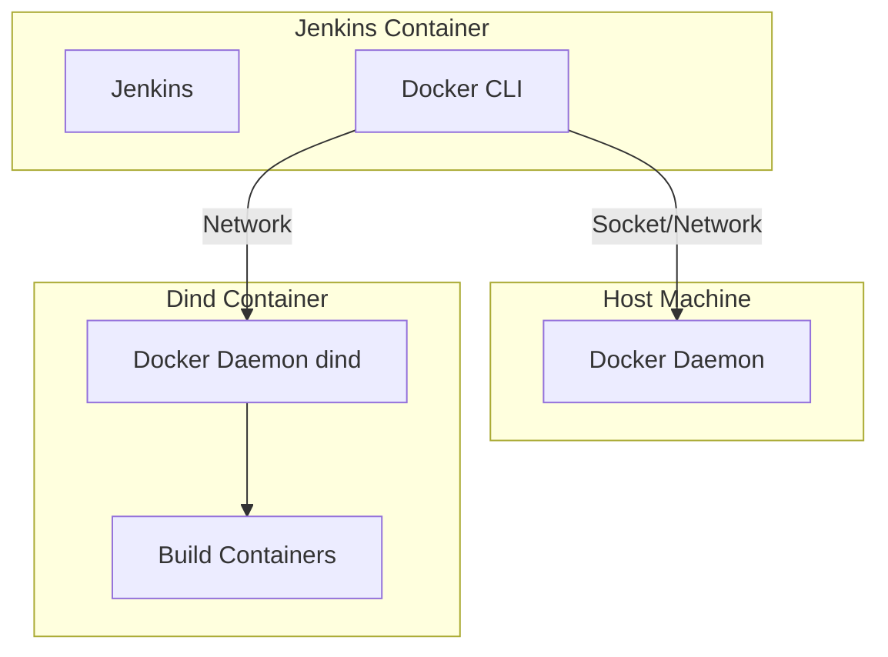
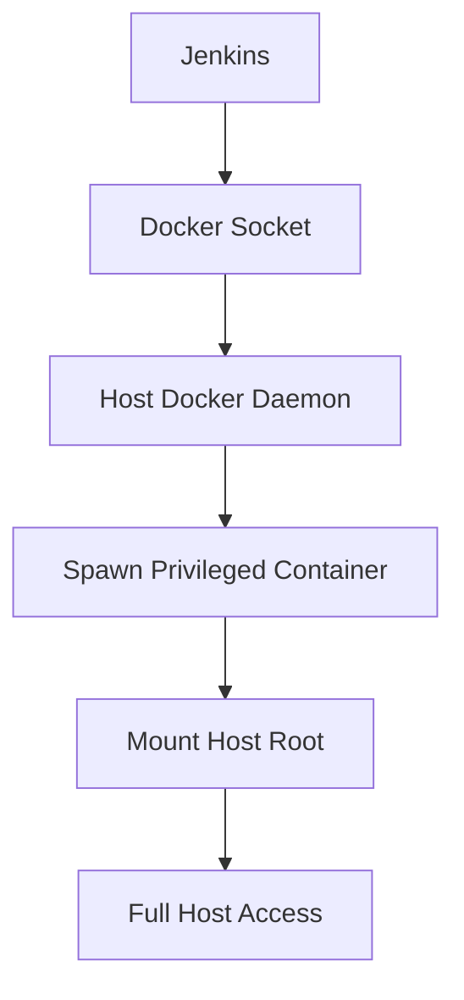

# Docker-in-Docker (DiND)

To build Docker images from Jenkins pipelines, Jenkins must communicate with a Docker daemon.

## Architecture Overview



## Connection Methods

| Method | Description | Security |
|--------|-------------|----------|
| **Mount Docker Socket** | `-v /var/run/docker.sock:/var/run/docker.sock` | ⚠️ Low - Jenkins has full host Docker access |
| **Docker-in-Docker (dind)** | Separate Docker daemon in isolated container | ⚠️ Medium - Better isolation |
| **Docker Out-of-Docker** | Jenkins container connects to host daemon | ⚠️ Similar to socket mount |

Jenkins acts as the **client**, while the Docker daemon performs the actual builds.

## Method 1: Docker Socket Mount

### Configuration

```yaml
version: '3.8'

services:
  jenkins:
    image: jenkins-docker:latest
    volumes:
      - jenkins-data:/var/jenkins_home
      - /var/run/docker.sock:/var/run/docker.sock
    ports:
      - "8080:8080"
```

### Pros

- Simple setup
- Direct access to host Docker daemon
- No additional container overhead

### Cons

- **Security risk**: Jenkins has full control over host Docker
- Can spawn privileged containers
- Potential container escape vector

## Method 2: Docker-in-Docker (dind)

### Configuration

```yaml
version: '3.8'

services:
  dind:
    image: docker:dind
    privileged: true
    environment:
      - DOCKER_TLS_CERTDIR=
    volumes:
      - dind-data:/var/lib/docker
  
  jenkins:
    image: jenkins-docker:latest
    environment:
      - DOCKER_HOST=tcp://dind:2375
    depends_on:
      - dind
```

### Pros

- Better isolation from host
- Separate Docker daemon for builds
- Can be network-isolated

### Cons

- Requires privileged container
- Additional resource overhead
- More complex networking

## Method 3: Docker Out-of-Docker

### Configuration

```yaml
version: '3.8'

services:
  jenkins:
    image: jenkins-docker:latest
    volumes:
      - jenkins-data:/var/jenkins_home
      - /var/run/docker.sock:/var/run/docker.sock
    environment:
      - DOCKER_HOST=unix:///var/run/docker.sock
```

This is essentially the same as socket mount but with explicit `DOCKER_HOST` configuration.

## Pipeline Example

```groovy
pipeline {
    agent any
    stages {
        stage('Build Docker Image') {
            steps {
                sh 'docker build -t myapp:latest .'
                sh 'docker push myapp:latest'
            }
        }
        stage('Run Tests in Container') {
            steps {
                sh 'docker run --rm myapp:latest npm test'
            }
        }
    }
}
```

## Security Considerations

### Docker Socket Access

Mounting the Docker socket gives Jenkins **root-equivalent access** to the host:



### Mitigation Strategies

1. **Use Docker socket proxy** - Limit available Docker API endpoints
2. **Run Jenkins in isolated network** - Prevent lateral movement
3. **Use rootless Docker** - Reduce privilege escalation risk
4. **Implement RBAC** - Restrict Jenkins pipeline permissions
5. **Audit Docker commands** - Log all Docker operations

## Recommendation

For **development environments**: Docker socket mount is acceptable for simplicity.

For **production environments**: 
- Use a Docker socket proxy with limited permissions
- Implement network isolation
- Consider rootless Docker setups
- Add comprehensive logging and monitoring

## Next Steps

- [Custom Jenkins Image](custom-jenkins-image.md) - Build Jenkins with Docker CLI
- [Security Risks](security-risks.md) - Understand attack vectors
- [Reverse Proxy](reverse-proxy.md) - Secure Jenkins access
