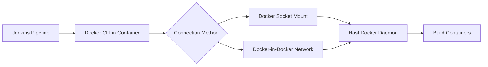

# Quick Reference

## Dockerfile Template

```dockerfile
FROM jenkins/jenkins:lts

USER root

RUN apt-get update \
 && apt-get install -y docker-ce-cli \
 && rm -rf /var/lib/apt/lists/*

USER jenkins
```

## Essential Commands

```bash
# Build Jenkins image with Docker CLI
docker build -t jenkins-docker:latest .

# Run Jenkins (development - not production ready)
docker run -d -p 8080:8080 -v jenkins-data:/var/jenkins_home \
  -v /var/run/docker.sock:/var/run/docker.sock \
  --name jenkins jenkins-docker:latest

# Run with Docker Compose (recommended)
docker-compose up -d
```

## Security Checklist

- [ ] Jenkins behind Nginx reverse proxy
- [ ] HTTPS with valid SSL certificate
- [ ] Authentication enabled
- [ ] Script console disabled or restricted
- [ ] Docker socket access minimized
- [ ] Network isolation configured
- [ ] Regular updates scheduled
- [ ] Access logs monitored

## Pipeline Example

```groovy
pipeline {
    agent any
    stages {
        stage('Build Docker Image') {
            steps {
                sh 'docker build -t myapp:${BUILD_NUMBER} .'
                sh 'docker push myapp:${BUILD_NUMBER}'
                sh 'docker run --rm myapp:${BUILD_NUMBER} npm test'
            }
        }
    }
}
```

## Architecture Overview



## Next Steps

- [Jenkins Host vs Container](jenkins-host-vs-container.md) - Understand deployment options
- [Docker-in-Docker](docker-in-docker.md) - Learn about Docker build architectures
- [Security Risks](security-risks.md) - Critical security considerations
- [Reverse Proxy](reverse-proxy.md) - Production deployment patterns
