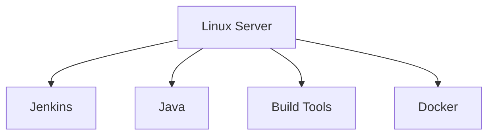
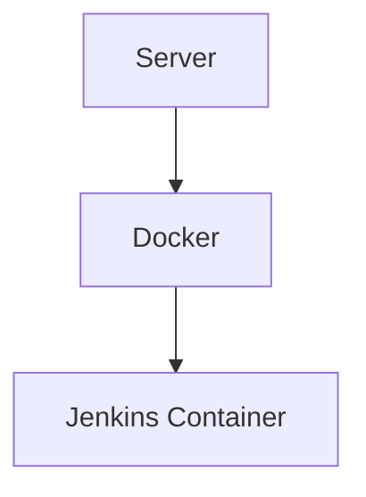

# Jenkins Host vs Container

Jenkins can run directly on a server (host installation) or inside a container.

## Host Installation

### Advantages

| Advantage | Description |
|-----------|-------------|
| Simple to install | Direct installation on the server |
| Easy to access system resources | No container isolation |
| Direct hardware access | Full hardware utilization |
| No container overhead | Native performance |

### Disadvantages

| Disadvantage | Description |
|--------------|-------------|
| Dependency conflicts | Build tools may conflict |
| Harder to migrate | Server-specific configuration |
| Less reproducible environments | Environment drift |
| Manual backup/restore | No container snapshots |

## Containerized Jenkins

### Advantages

| Advantage | Description |
|-----------|-------------|
| Reproducible environment | Same container everywhere |
| Easier upgrades | Swap container images |
| Better isolation | Container boundaries |
| Simple backup (volume-based) | Backup Jenkins home volume |

### Disadvantages

| Disadvantage | Description |
|--------------|-------------|
| Requires Docker knowledge | Container management learning curve |
| Docker socket security considerations | Additional security configuration |
| Some build tools must run via containers | Nested container requirements |
| Network configuration complexity | Container networking setup |

## Comparison Summary

| Criteria | Host | Container |
|----------|------|-----------|
| **Setup Complexity** | Low | Medium |
| **Portability** | Low | High |
| **Isolation** | Low | High |
| **Resource Overhead** | None | Minimal |
| **Backup Strategy** | Manual | Volume-based |
| **Upgrade Process** | Manual | Image swap |
| **Security** | Depends on OS | Container + OS |

## Recommendation

For most modern deployments, **containerized Jenkins** is recommended because:

1. **Reproducibility** - Same environment across dev, staging, production
2. **Portability** - Easy to move between servers
3. **Isolation** - Better security boundaries
4. **Maintenance** - Simpler upgrades and rollbacks

However, host installation may be suitable for:
- Simple single-server setups
- Environments where Docker is not available
- Teams without container operations experience

## Next Steps

- [Docker-in-Docker](docker-in-docker.md) - Enable Docker builds from Jenkins
- [Custom Jenkins Image](custom-jenkins-image.md) - Create Jenkins image with Docker CLI
- [Security Risks](security-risks.md) - Understand security implications
