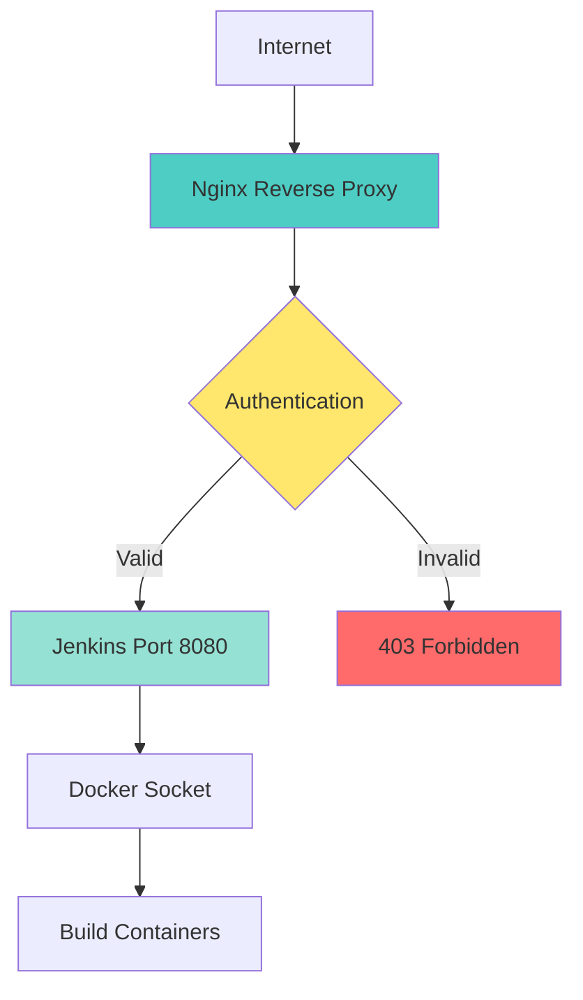

# Reverse Proxy Pattern

## Why Use a Reverse Proxy?

Placing Jenkins behind a reverse proxy (Nginx, Apache, Traefik) provides:

| Benefit | Description |
|---------|-------------|
| **HTTPS Termination** | Handle SSL/TLS at the proxy level, encrypting all traffic |
| **Authentication Layer** | Add additional authentication (Basic Auth, OAuth) before Jenkins |
| **Rate Limiting** | Protect against brute force and DDoS attacks |
| **Access Control** | Restrict access by IP address, geographic location, or other criteria |
| **Logging & Monitoring** | Centralized access logs and request tracking |
| **Load Balancing** | Distribute traffic across multiple Jenkins instances |

## Architecture



## Nginx Configuration Example

### Basic Configuration

```nginx
server {
    listen 80;
    server_name jenkins.yourdomain.com;
    
    # Redirect HTTP to HTTPS
    return 301 https://$server_name$request_uri;
}

server {
    listen 443 ssl http2;
    server_name jenkins.yourdomain.com;

    # SSL Configuration
    ssl_certificate /etc/ssl/certs/jenkins.crt;
    ssl_certificate_key /etc/ssl/private/jenkins.key;
    ssl_protocols TLSv1.2 TLSv1.3;
    ssl_ciphers HIGH:!aNULL:!MD5;
    ssl_prefer_server_ciphers on;

    # Security Headers
    add_header X-Frame-Options "SAMEORIGIN" always;
    add_header X-Content-Type-Options "nosniff" always;
    add_header X-XSS-Protection "1; mode=block" always;
    add_header Strict-Transport-Security "max-age=31536000; includeSubDomains" always;

    # Jenkins Proxy
    location / {
        proxy_pass http://jenkins:8080;
        proxy_set_header Host $host;
        proxy_set_header X-Real-IP $remote_addr;
        proxy_set_header X-Forwarded-For $proxy_add_x_forwarded_for;
        proxy_set_header X-Forwarded-Proto $scheme;
        proxy_set_header X-Forwarded-Host $host;
        proxy_set_header X-Forwarded-Port $server_port;
        
        # WebSocket support (for Jenkins CLI)
        proxy_http_version 1.1;
        proxy_set_header Upgrade $http_upgrade;
        proxy_set_header Connection "upgrade";
        
        # Timeout settings
        proxy_connect_timeout 600s;
        proxy_send_timeout 600s;
        proxy_read_timeout 600s;
    }

    # Optional: IP Whitelist
    # allow 192.168.1.0/24;
    # allow 10.0.0.0/8;
    # deny all;
}
```

### With Basic Authentication

```nginx
server {
    listen 443 ssl http2;
    server_name jenkins.yourdomain.com;

    ssl_certificate /etc/ssl/certs/jenkins.crt;
    ssl_certificate_key /etc/ssl/private/jenkins.key;

    # Basic Authentication
    auth_basic "Jenkins Authentication";
    auth_basic_user_file /etc/nginx/.htpasswd;

    location / {
        proxy_pass http://jenkins:8080;
        proxy_set_header Host $host;
        proxy_set_header X-Real-IP $remote_addr;
        proxy_set_header X-Forwarded-For $proxy_add_x_forwarded_for;
        proxy_set_header X-Forwarded-Proto $scheme;
    }
}
```

Generate `.htpasswd` file:

```bash
# Install apache2-utils (for htpasswd command)
apt-get install apache2-utils

# Create password file
htpasswd -c /etc/nginx/.htpasswd jenkins-user
```

## Docker Compose Example

```yaml
version: '3.8'

services:
  nginx:
    image: nginx:alpine
    container_name: jenkins-nginx
    ports:
      - "80:80"
      - "443:443"
    volumes:
      - ./nginx/nginx.conf:/etc/nginx/nginx.conf:ro
      - ./nginx/ssl:/etc/ssl/certs:ro
      - ./nginx/.htpasswd:/etc/nginx/.htpasswd:ro
    depends_on:
      - jenkins
    networks:
      - jenkins-network
    restart: unless-stopped

  jenkins:
    image: jenkins-docker:latest
    container_name: jenkins
    expose:
      - "8080"
      - "50000"
    volumes:
      - jenkins-data:/var/jenkins_home
      - /var/run/docker.sock:/var/run/docker.sock
    networks:
      - jenkins-network
    environment:
      - JAVA_OPTS=-Djenkins.install.runSetupWizard=false
    restart: unless-stopped

volumes:
  jenkins-data:

networks:
  jenkins-network:
    driver: bridge
```

## Project Structure

```
project/
├── docker-compose.yml
├── nginx/
│   ├── nginx.conf
│   ├── ssl/
│   │   ├── jenkins.crt
│   │   └── jenkins.key
│   └── .htpasswd
└── jenkins-data/  (volume)
```

## SSL Certificate Options

### 1. Let's Encrypt (Recommended)

Free, auto-renewing SSL certificates:

```bash
# Install Certbot
apt-get install certbot python3-certbot-nginx

# Get certificate
certbot --nginx -d jenkins.yourdomain.com

# Auto-renewal (cron job)
0 0 1 * * certbot renew --quiet
```

### 2. Self-Signed (Development Only)

```bash
# Generate self-signed certificate
openssl req -x509 -nodes -days 365 -newkey rsa:2048 \
  -keyout jenkins.key \
  -out jenkins.crt \
  -subj "/C=US/ST=State/L=City/O=Organization/CN=jenkins.yourdomain.com"
```

### 3. Corporate CA

Use your organization's internal Certificate Authority.

## Best Practices

### 1. Security Headers

```nginx
# Add to nginx.conf
add_header X-Frame-Options "SAMEORIGIN" always;
add_header X-Content-Type-Options "nosniff" always;
add_header X-XSS-Protection "1; mode=block" always;
add_header Referrer-Policy "strict-origin-when-cross-origin" always;
add_header Content-Security-Policy "default-src 'self'; script-src 'self' 'unsafe-inline' 'unsafe-eval'; style-src 'self' 'unsafe-inline';" always;
add_header Strict-Transport-Security "max-age=31536000; includeSubDomains" always;
```

### 2. Rate Limiting

```nginx
# In http block
limit_req_zone $binary_remote_addr zone=jenkins_limit:10m rate=10r/s;

# In location block
limit_req zone=jenkins_limit burst=20 nodelay;
```

### 3. Access Logging

```nginx
access_log /var/log/nginx/jenkins-access.log;
error_log /var/log/nginx/jenkins-error.log;
```

### 4. Health Check Endpoint

```nginx
location /health {
    access_log off;
    return 200 "healthy\n";
    add_header Content-Type text/plain;
}
```

## Testing Configuration

```bash
# Test Nginx configuration
nginx -t

# Reload Nginx
nginx -s reload

# Check SSL configuration
openssl s_client -connect jenkins.yourdomain.com:443

# Test with curl
curl -I https://jenkins.yourdomain.com
```

## Troubleshooting

### WebSocket Connection Issues

Ensure WebSocket upgrade headers are set:

```nginx
proxy_http_version 1.1;
proxy_set_header Upgrade $http_upgrade;
proxy_set_header Connection "upgrade";
```

### 502 Bad Gateway

Check that Jenkins is running and accessible:

```bash
docker ps | grep jenkins
docker logs jenkins
```

### SSL Certificate Errors

Verify certificate paths and permissions:

```bash
ls -la /etc/ssl/certs/jenkins.crt
ls -la /etc/ssl/private/jenkins.key
```

## Next Steps

- [Additional Resources](resources.md) - Further reading and references
