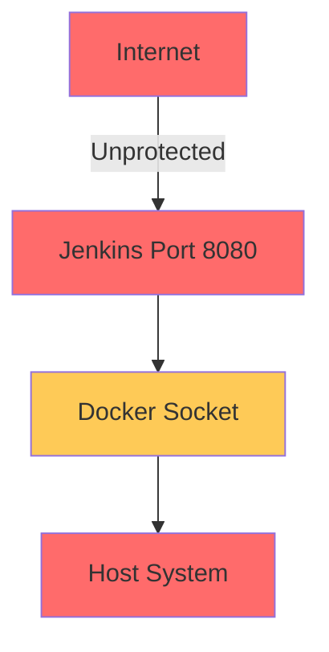
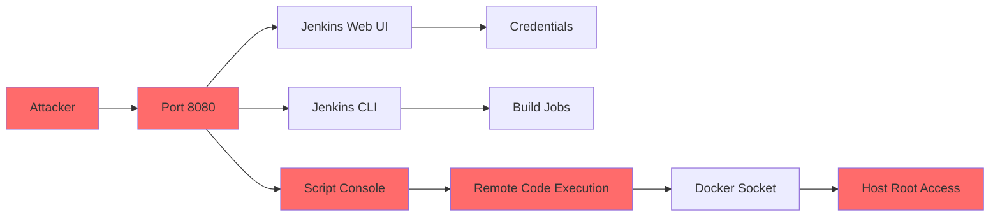
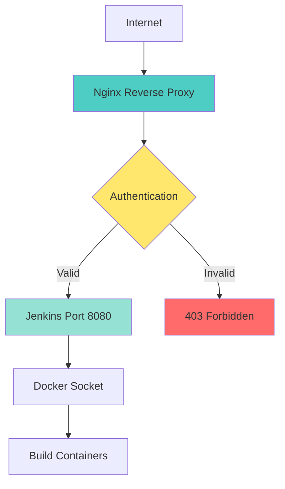

# Security Risks: Exposing Jenkins on Port 8080

## The Problem

A common mistake in self-hosted setups is exposing Jenkins directly to the internet without proper protection:



## Key Security Risks

| Risk | Impact | Description |
|------|--------|-------------|
| **Docker Socket Access** | 🔴 Critical | Jenkins with Docker socket access can spawn privileged containers, effectively giving root access to the host |
| **Container Escape** | 🔴 Critical | Vulnerabilities in Jenkins or plugins can allow attackers to escape the container and access the host system |
| **Unauthenticated Access** | 🔴 Critical | Default Jenkins setup may allow unauthenticated script console access, enabling remote code execution |
| **Network Exposure** | 🟡 High | Direct exposure on port 8080 without HTTPS means credentials and build logs are transmitted in plain text |
| **Plugin Vulnerabilities** | 🟡 High | Outdated or vulnerable plugins can provide attack vectors for exploitation |

## Attack Surface



## Attack Vectors

### 1. Script Console Exploitation

The Jenkins Script Console allows executing arbitrary Groovy code:

```groovy
// Malicious script that attackers could run
"rm -rf /".execute()
```

**Impact**: Full remote code execution on the host system.

### 2. Docker Socket Abuse

With Docker socket access, attackers can:

```bash
# Spawn a privileged container with host filesystem
docker run -it --privileged -v /:/host alpine chroot /host

# Now has full root access to host
```

**Impact**: Complete host compromise.

### 3. Credential Theft

Jenkins stores credentials in `credentials.xml`:

```xml
<com.cloudbees.plugins.credentials.impl.UsernamePasswordCredentialsImpl>
  <username>admin</username>
  <password>{AES}encrypted_password</password>
</com.cloudbees.plugins.credentials.impl.UsernamePasswordCredentialsImpl>
```

**Impact**: Access to connected systems (Docker registries, Git repos, cloud providers).

### 4. Plugin Vulnerabilities

Historical Jenkins plugin vulnerabilities:
- CVE-2024-23897: Arbitrary file read
- CVE-2023-40433: XSS and CSRF
- CVE-2022-20607: Remote code execution

## Mitigation Strategies

### 1. Never Expose Port 8080 Directly

Always use a reverse proxy:



### 2. Enable HTTPS

Use SSL/TLS certificates for encrypted communication:

```nginx
server {
    listen 443 ssl http2;
    ssl_certificate /etc/ssl/certs/jenkins.crt;
    ssl_certificate_key /etc/ssl/private/jenkins.key;
    ssl_protocols TLSv1.2 TLSv1.3;
}
```

### 3. Implement Authentication

Require login for all Jenkins access:

- Enable Jenkins security realm
- Use matrix-based authorization
- Consider LDAP/Active Directory integration

### 4. Restrict Script Console

Disable or heavily restrict the Groovy script console:

```groovy
// In Jenkins security configuration
// Disable script console entirely
System.setProperty("hudson.model.Runner.scriptConsoleDisabled", "true")
```

### 5. Regular Updates

Keep Jenkins and all plugins up to date:

```bash
# Enable automatic updates or set a schedule
# Check for updates weekly
```

### 6. Network Isolation

Use firewall rules to limit access:

```bash
# Only allow trusted IPs
iptables -A INPUT -p tcp --dport 8080 -s 192.168.1.0/24 -j ACCEPT
iptables -A INPUT -p tcp --dport 8080 -j DROP
```

### 7. Minimal Permissions

Run Jenkins with least-privilege Docker socket access:

- Use Docker socket proxy
- Implement rootless Docker
- Restrict available Docker commands

## Security Checklist

- [ ] Jenkins behind reverse proxy (Nginx, Apache, Traefik)
- [ ] HTTPS with valid SSL certificate
- [ ] Authentication enabled for all users
- [ ] Script console disabled or restricted
- [ ] Docker socket access minimized or proxied
- [ ] Network isolation configured (firewall rules)
- [ ] Regular Jenkins and plugin updates scheduled
- [ ] Access logs monitored for suspicious activity
- [ ] Credentials regularly rotated
- [ ] Backup strategy in place

## Next Steps

- [Reverse Proxy Pattern](reverse-proxy.md) - Implement secure access with Nginx
